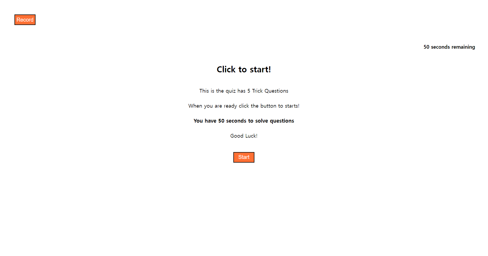

# quiz-challenge

## Description

This is a quiz template for the trick questions

which is including localsaving and deleting 

I used JSON.stringfy and JSON.parse to store data

It was hard to figure out the position of the code but 

It works properly as I intended and discriped on the User Story and the Acceptance Criteria

## User Story 

```
AS A coding boot camp student
I WANT to take a timed quiz on JavaScript fundamentals that stores high scores
SO THAT I can gauge my progress compared to my peers
```

## Acceptance Criteria 

```
GIVEN I am taking a code quiz
WHEN I click the start button
THEN a timer starts and I am presented with a question
WHEN I answer a question
THEN I am presented with another question
WHEN I answer a question incorrectly
THEN time is subtracted from the clock
WHEN all questions are answered or the timer reaches 0
THEN the game is over
WHEN the game is over
THEN I can save my initials and my score
```

## Languages 

HTML, CSS, JavaScript

## Usage 

It is a quick 5 questions quiz with 5 trick quesitons

It is for the UW bootcamp chellenge Assignment Number 4 

This Homework was about the Local Storage and the coding with the JavaScript

## App ScreenShot



## Live Website 


# Contact 

Linkedin: https://www.linkedin.com/in/sangmi-yun-0a4241201/